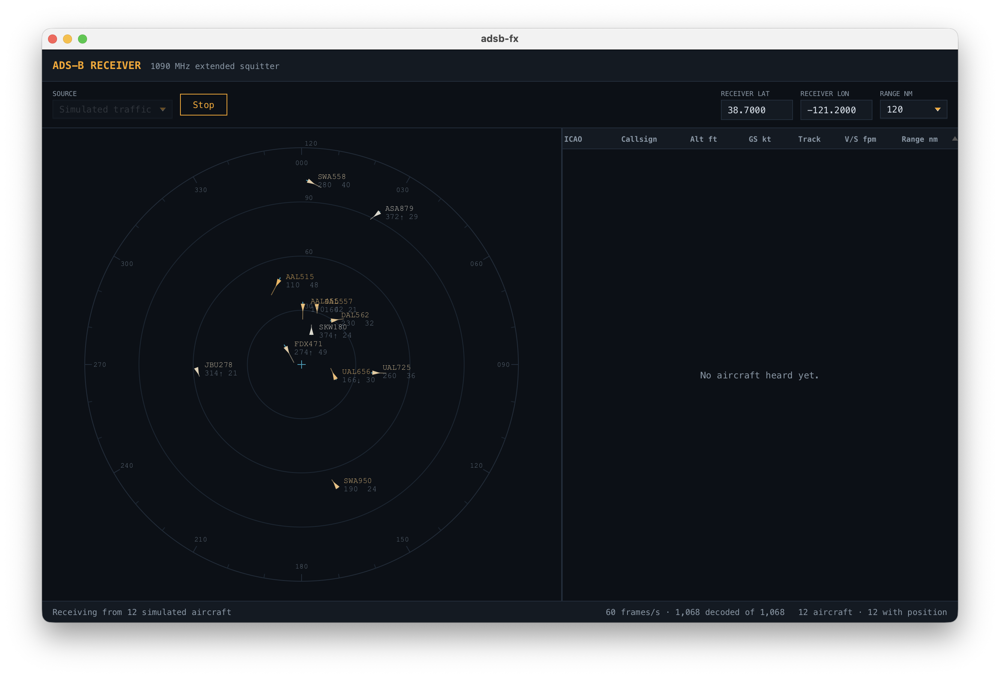

# adsb-fx-java

A JavaFX desktop receiver for 1090 MHz ADS-B, in Java 21 with Maven. It decodes
Mode S extended squitter frames itself — parity, CPR, altitude, velocity — and
shows the traffic as a live table plus a plan position display.




## Running it

```bash
mvn javafx:run
```

The `javafx-maven-plugin` puts the JavaFX modules on the module path, so no
`--add-modules` juggling is needed. `mvn test` runs the suite; `mvn package`
builds the jar, though the plain jar still needs JavaFX supplied at launch.

### Without a dongle

Pick **Simulated traffic** in the source box, enter a receiver latitude and
longitude, and press **Start receiving**. The simulator encodes real, CRC-valid
DF17 frames for invented aircraft and feeds them through the same decode path as
live traffic, so it exercises everything except the radio.

### With a dongle

The app consumes AVR-format frames from `dump1090`. Either point it at a running
instance:

```bash
dump1090 --net --quiet          # serves raw frames on TCP 30002
```

then choose **dump1090 over TCP**, host `127.0.0.1`, port `30002` — or choose
**Launch dump1090** and let the app spawn `dump1090 --raw` itself and own the
process lifetime. Only one program can hold the USB device at a time, so those
two options are mutually exclusive.

`readsb` and `dump1090-fa` both work; set the command name accordingly.

Setting the receiver position unlocks range, bearing and the situation display.
The simulator does not need one — if the fields are empty it picks a centre and
fills them in, so you can see where the traffic is orbiting.

## Why dump1090 rather than talking to the dongle directly

Demodulating ADS-B means sampling at 2 MSPS, hunting the 8 µs preamble, slicing
PPM bits and error-correcting — a real DSP problem that `dump1090` already solves
well, in C, with years of field tuning behind it. Reimplementing it in Java would
cost the accuracy without buying anything the interface needs.

The `AdsbSource` interface is the seam. An `RtlUsbSource` that drives
`librtlsdr` over JNA and demodulates in-process would drop in beside the existing
three implementations without the tracker or UI noticing.

## Layout

```
decode/   Bits, ModeS, Cpr, AdsbDecoder — stateless, no JavaFX, no I/O
model/    Aircraft, AircraftTracker, Geo — FX-thread confined
source/   AdsbSource + TCP, subprocess and simulated implementations
ui/       AdsbApp, AircraftTable, SituationDisplay, Palette
```

`AdsbMessage` is a sealed interface over records, so the tracker dispatches with
an exhaustive pattern-matching switch and the compiler catches a forgotten case
when a new message type is added.

Threading is deliberately boring. Sources own their own threads and hand
immutable decoded messages to a `ConcurrentLinkedQueue`. An `AnimationTimer`
drains that queue on the FX thread and is the only thing that ever touches the
tracker, so the table binds straight to `Aircraft` properties with no locks and
no `Platform.runLater` per message.

Boxed types in the decoder mark fields a transmission may legitimately omit. A
velocity message with no vertical rate source carries no vertical rate, and a
zero there would be a lie rather than a reading.

## How a position is recovered

CPR resolution lives in the tracker rather than the decoder because it needs
history. Every aircraft's **first** fix comes from a matched odd/even pair inside
a 10-second window. Only after that are single frames decoded locally against
that aircraft's own last position.

Seeding a local decode from the receiver's position is tempting — it produces a
first fix a second or two sooner — but it is unsafe in a way that hides itself: a
wrong-zone local solve lands *near whatever reference it was given*, so a bogus
position seeded from the receiver looks entirely plausible and passes any range
check you could apply to it. Waiting for a pair costs a couple of seconds and
removes the failure mode.

## What the display shows

Each target is a chevron pointing along its track, tinted by altitude — amber low,
pale up high. The line ahead of it is one minute of travel at present groundspeed,
so leader length reads as speed. The block beside it is flight level, a climb or
descent arrow, and groundspeed in tens of knots. Faint blue behind it is the
recent track history.

## Known gaps

- **Gillham altitudes.** Frames with the Q bit clear (100 ft encoding, above
  FL500) return no altitude rather than a guess.
- **Beast binary format** (port 30005) is not parsed; AVR text only.
- **DF20/21 Comm-B** replies are ignored, so Mode S–only aircraft appear on the
  list via all-call replies but never gain a position.
- **No error correction.** Frames failing parity are dropped rather than
  single-bit repaired, which costs some range on a marginal antenna.
- **No aircraft registry lookup** — ICAO addresses are shown raw, not resolved to
  registration or type.
- **No `module-info.java`.** The app runs on the class path with JavaFX on the
  module path, which is what the plugin sets up. Add one if you want `jlink`.

## Tests

```bash
mvn test
```

`AdsbDecoderTest` runs published reference frames through the decoder and checks
callsign, altitude, both CPR paths and velocity against known values.
`AircraftTrackerTest` covers CPR pairing, the rejection of unpaired and
implausible fixes, and staleness pruning — none of which need a running FX
toolkit. `SimulatedSourceTest` round-trips the simulator's encoder through the
decoder.
